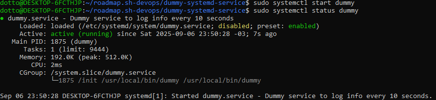
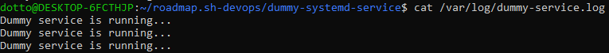
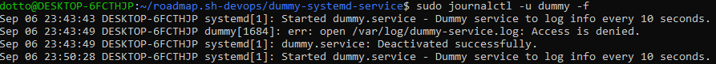

# Dummy Systemd Service
A long-running systemd service that logs to a file. 

## Getting Started
1. **Clone the repository**
    ```
    git clone https://github.com/dottox/roadmap.sh-devops
    cd beginner-projects/dummy-systemd-service
    ```

2. **(If dummy not compiled) Compile dummy.go**
    ```
    go build -o dummy dummy.go
    ```
3. **Copy Dummy service to WSL/VSI**  
    ```
    cp /current/path/of/dummy.service /etc/systemd/system/
    ```
4. **Create the log file and change perms**  
    ```
    sudo touch /var/log/dummy-service.log
    sudo chown <your-user>:<your-user> /var/log/dummy-service.log
    sudo chmod 0644 /var/log/dummy-service.log
    ```
5. **Start the service**  
    ```
    sudo systemctl daemon-reload
    sudo systemctl start dummy
    sudo systemctl status dummy
    ```
    
6. **Check logs**  
    ```
    cat /var/log/dummy-service.log
    ```
    
    
This project is part of [roadmap.sh](https://roavdmap.sh/projects/log-archive-tool) DevOps projects.