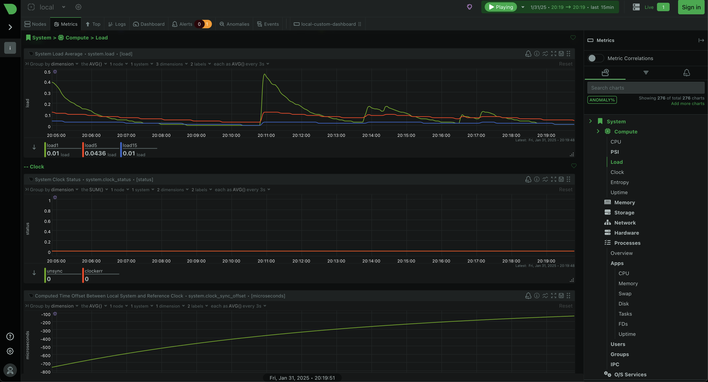
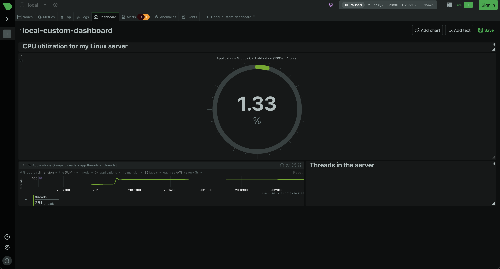
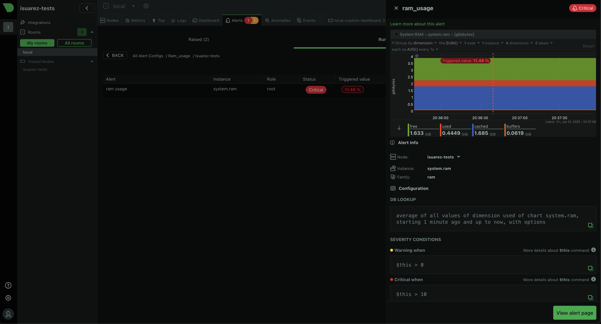

# Simple monitoring
Set up a basic monitoring dashboard using Netdata.

## Getting Started
1. **Create a Remote Server**
Create your a Linux server using you preferred Cloud Provider.

- Create a new Linux server (e.g., Ubuntu 20.04 LTS).
- Note down the server's IP address.

2. **Install Netdata on your Linux server**
Install Netdata following their [instruction](https://learn.netdata.cloud/docs/netdata-agent/installation/linux/)
    ```
    wget -O /tmp/netdata-kickstart.sh https://get.netdata.cloud/kickstart.sh && sh /tmp/netdata-kickstart.sh
    ```

> You may accept the installation. Netdata will automatically start to collect basic metrics so no configuration is required.

> [!NOTE]
> Netdata has a web-dashboard that you will use to monitor, you can access this web with: http://localhost:19999



3. **Create and modify dashboards your way**  
You can use the dashboard to insert any metric you want, from any source, in any type of graphic.



4. **Set up custom alerts**  
You can configure your own alert. I will configure an alert for the ram usage.
    ```
    cd /etc/netdata/
    sudo touch health.d/ram-usage.conf
    ```

> ram-usage is the name of the alert.

    ```
    sudo ./edit-config health.d/ram-usage.conf
    ```

    ```
    # ram-usage.conf

    alarm: ram_usage
    on: system.ram
    lookup: average -1m percentage of used
    units: %
    every: 1m
      warn: $this > 80
      crit: $this > 90
      info: The percentage of RAM being used by the system.
    ```

> [!NOTE]
> You can configure this alarm as you want. This alarm is explained [here](https://learn.netdata.cloud/docs/alerts-&-notifications/alert-configuration-reference)




5. **Scripts for: installing, testing and cleanup**  
Scripts for installing, testing and cleaning up are [here](https://github.com/dottox/roadmap.sh-devops/tree/main/beginner-projects/simple-monitoring/scripts)


This project is part of [roadmap.sh](https://roadmap.sh/projects/simple-monitoring-dashboard) DevOps projects.